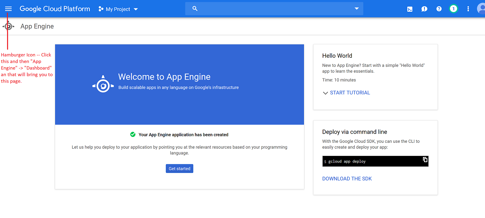
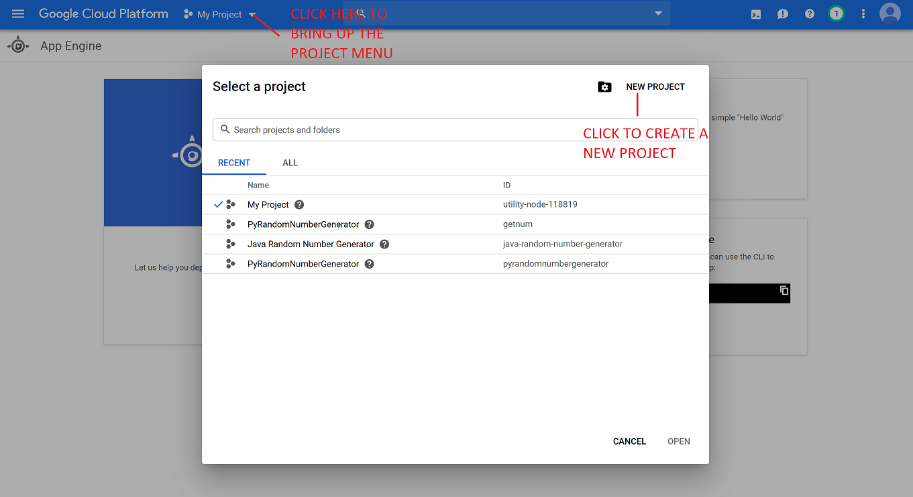
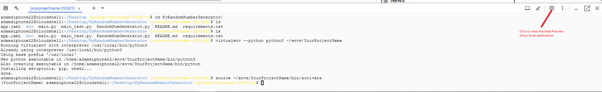

# Random Number Web Application for Google Cloud 

## Table of Contents
1. [Introduction](#introduction)
2. [AppEngine](#appengine)
	 1. [ How to Access AppEngine](#howtoapp)
	 2. [ How to Install Java Server](#appjava)
	 3. [ How to Install Python Server](#apppy)
3. [Virtual Machines](#vm)
	1. [ How to Access Virtual Machine](#howtovm)
	2. [How to Install Java Server](#vmjava)
	3. [How to Install Python Server](#vmpy)


## Introduction <a name="introduction"></a>

This document is a comprehensive guide to setting up and installing the Random Number Web Application for both python and java on both Google Cloud Virtual Environments as well as Google Cloud AppEngine. 

## Description of Random Number Web Application
The randNum web application allows a user to connect to a web address and receive a random number between 1 and 1 million with a guarantee that 750 of 1000 consecutive numbers will be unique. On the back end, this system can either be run using python or java on either  virtual machines or AppEngine.

# AppEngine <a name="appengine"></a>
## How to Access AppEngine <a name="howtoapp"></a>

1. Visit [https://console.cloud.google.com](https://console.cloud.google.com/)
2. Select an existing google account or create a new one.
3. From the dashboard click the hamburger symbol. Then select App Engine-> Dashboard.

4. Click the down arrow next to "MyFirstProject", then select "New Project" from the top right corner. ***Note: Take down your project id at this point. it is located in this same window after your project is creted on the right hand side.**

5. Select "Activate Cloud Shell" button in the top right on the Nav bar.

## How to install [Java server](https://github.com/agracy2246/JavaRandomNumberGenerator) <a name="appjava"></a>
6. Copy this into the command line: 
    `git clone https://github.com/agracy2246/JavaRandomNumberGenerator` 
7. Change to the JavaRandomNumberGenerator directory by copying this code into the command line: `cd JavaRandomNumberGenerator`
8. To test your app on the cloud shell enter: `mvn appengine:run`
9. Your app is now running on cloud shell, it can be accessed on the web via the web preview button in the upper right hand corner of the cloud shell console, and then selecting Preview on port 8080. To terminate  the test hit ctrl+c.
10. In order to deploy your app follow these steps:
	   a) First set which project to use (this is where you will need your project Id see *Note above) by copying this code into the command line after inserting your project id: `gcloud config set project *YOUR PROJECT ID*`
	   b) Then deploy by copying this into the command line: `mvn appengine:deploy`
### Congratulations
Your app has been deployed and can be viewed at url: YourProjectId.appspot.com

## How to install [Python server](https://github.com/agracy2246/PyRandomNumberGenerator) <a name="apppy"></a>
6.) Clone the PyRandomNumberGenerator repository to your cloud console by running the following command:  
    ` git clone https://github.com/agracy2246/PyRandomNumberGenerator.git `

7.) Enter the directory you just created by running the following comand:  
    ` cd PyRandomNumberGenerator `

8.) To test your app locally (on the cloud shell), complete the steps:
  * Run the following command to create an isolated virtual environment:
     ` virtualenv --python python3 ~/envs/<YOUR_PROJECT_NAME> `
  * Next, run this command to activate your virtual environment:
     ` source ~/envs/<YOUR_PROJECT_NAME>/bin/activate `
  * Now, we need to install the required modules for the application. We can find this in ` requirements.txt `. Run the following:` pip install -r requirements.txt `
  * Finally, we start our application in the cloud shelll by running the Flask development server:
    ` python main.py `
  * Our application is now running locally! You can preview this local instance by clicking the "Web preview" button on the top right of the console window. Press **Control+c** to end this local instance after you have previewed it.  
  
  
<br>
<br>
<br>
9.) Let's deploy! First we need to create an **application** that we can deploy. Run the following command:  
` gcloud app create `
<br>
***Note:** A prompt may ask for the region you would like the application hosted.

10.) The last step is to run the following command:  
` gcloud app deploy app.yaml --project <Your Project ID> `
and enter **'y'** to complete deployment.<br>
***Note:** Use the **Project ID** you took note of in **Step 4**.

### Congratulations!
If you did everything correctly, you can view your application live at ` <Your Project ID>.appspot.com `

# VirtualMachines <a name="vm"></a>
## How to access virtual machine <a name="howtovm"></a>
Sign in to your google cloud account and go to the console. 

* Create a new project 

* Click the menu icon in the top left of the console

* Select the Compute Engine >  VM instances

* Select Create Instance

* Chose a name for your instance and preferred region and zone 

* Select your preferred Machine configuration.

  | ⚠️ **Warning**:                                               |
  | ------------------------------------------------------------ |
  | The choice of machine type will effect the cost of the operation. Although you may choose any machine configuration, our suggestion is to use ```First generation g1-small``` which will be sufficient. |
  | We are using the `Ubuntu 16.04 LTS` for this application     |

* In the `Firewall` section,  toggle the **Allow HTTP traffic** and **Allow HTTPS traffic** on.
* Save and wait to VM to load up.  

### Connecting to the VM

* Click the `ssh` button under the `connection` section to connect the terminal. 

## How to install [Java server](https://github.com/ZachArani/RandNumJavaServerVM) <a name="vmjava"></a>
### Installation
On an Ubuntu system run: `sudo apt-get install tomcat8`. If you are on another **nix* based system use your package manager of choice or download the source code from [Apache's website](https://tomcat.apache.org/download-80.cgi). This will all install Java and other dependencies if not already installed.

### Install Directories
Tomcat then creates several directories of note:
`/etc/tomcat8/`: Stores all configuration files, namely `server.xml`
`/usr/share/tomcat8/`: Runtime directory, also known as *CATALINA_HOME*
`/var/lib/tomcat8/webapps`: For webapp installations

### Modify Configurations
First, we will modify `/etc/tomcat8/server.xml` to change our port and allow external connections.
Open the file using a text editor and find this block of code (i.e.)
`sudo nano /etc/tomcat8/server.xml`
```
<Connector port="8080" protocol="HTTP/1.1"
               connectionTimeout="20000"
               redirectPort="8443" />
```

Modify the port number to either be 80 or your port of choice. Also add the line `address="0.0.0.0"` or your address of choice for external connections, if desired.
With the port 80, and the default address, our new configuration should look like this:

```
<Connector port="80" protocol="HTTP/1.1"
               address="0.0.0.0"
               connectionTimeout="20000"
               redirectPort="8443" />
```

Now exit the file (`ctrl+x, y, enter` on nano) and save. 

If you set your port number to something below 1023 you must also edit `/etc/default/tomcat8` and add the line `AUTHBIND=yes` to the bottom of the file. 

### Installing the Web Application (randNum)
In order to install web application, the file `randNum.war` simply needs to be copied to `/var/lib/tomcat8/webapps` and the server needs to be restarted. You can get this war from either compiling the [source code yourself or using the pre-compiled WAR file in the repo.](https://github.com/ZachArani/RandNumJavaServerVM)

For example, if our given application is located at `~/randNum.war` then we need to simply run `sudo cp ~/randNum.war /var/lib/tomcat8/webapps/` to copy the file to the proper destination.

In order to restart the server, run `sudo service tomcat8 restart`. 

### Usage
Depending on the port listed, You can access the server like so `http://<IP>:<PORT>/randNum`. If your port is set to 80, then it shall be `http://<IP>/randNum`. For example: `http://http://35.202.141.106/randNum` Connecting to the web address will bring about a random single numerical output between 1 and 1 million, with a guarantee that at least 750 out of 1000 numbers will be unique. 

**IMPORTANT NOTE:** The *first* connection to the server will take quite some time, due to a combination of limitations with both tomcat itself and the google cloud platform. It is recommended to run the `lynx`  (`sudo apt-get install lynx` to install) web browser and run a connection to the server after launching (i.e. `lynx http://localhost:<PORT>`) and wait for it to connect before considering the app 'launched.' The first connection may take several minutes but every consecutive connection following (regardless of device) will be at a regular speed.

### Useful commands
The server can be controlled via the ubuntu `service` command. Here are some useful commands
`sudo service tomcat8 start`: Startup server
`sudo service tomcat8  stop`: Shutdown server
`sudo service tomcat8 restart`: Restart server
`sudo service tomcat8 status`: Get current server status

## How to install [Python server](https://github.com/yasharAhari/Random_num_VM) <a name="vmpy"></a>

### installing required software

* Update and Upgrade your machine using 

  ```shell
  sudo apt update -y; sudo apt upgrade -y 
  ```

  

* Install python 3.7

  we are using python 3.7 and  ```pyenv``` to handle python installation. For that, clone the ```pyenv``` form its git repo.
  For that simply run following command and restart yout shell 
  
  ```shell
  curl -L https://github.com/pyenv/pyenv-installer/raw/master/bin/pyenv-installer | bash
  ```
  
  In case this fails, you can do this manually by doing the following 2 step:
  

  1. Get pyenv
  ```shell
  git clone https://github.com/pyenv/pyenv.git ~/.pyenv
  ```

  2. Configure it:
  in order to ```pyenv``` work, it need to be configured in the machine ```.bashrc ``` file. For that do the following: 

  ```shell
  echo 'export PYENV_ROOT="$HOME/.pyenv"' >> ~/.bashrc
  echo 'export PATH="$PYENV_ROOT/bin:$PATH"' >> ~/.bashrc
  echo -e 'if command -v pyenv 1>/dev/null 2>&1; then\n  eval "$(pyenv init -)"\nfi' >> ~/.bashrc
  exec "$SHELL"
  ```

  

* Install the required Python build dependencies:

  ```shell
  sudo apt-get update; sudo apt-get install -y make build-essential libssl-dev zlib1g-dev libbz2-dev libreadline-dev libsqlite3-dev wget curl llvm libncurses5-dev xz-utils tk-dev libxml2-dev libxmlsec1-dev libffi-dev liblzma-dev
  ```

  

* After the build dependencies installed, use the ```pyenv``` to install the python 3.7.2 

  ```shell
  pyenv install 3.7.2
  ```

  This process might take few minutes on a small VM. In case of successful installation you will see the following:

  ```
  Downloading Python-3.7.2.tar.xz...
  -> https://www.python.org/ftp/python/3.7.2/Python-3.7.2.tar.xz
  Installing Python-3.7.2...
  ```

* Now set the system python as 7.3.2

  ```
  pyenv global 3.7.2
  ```

  

### Cloning the app 

Go to the directory that you want the application work on, or just create a new directory in the home.

we call this directory ```APYZ_Random_PVM```

```shell
cd; mkdir APYZ_Random_PVM; cd APYZ_Random_PVM
```

And now clone the GitHub repository to get the necessary files.

 ```shell
git clone https://github.com/yasharAhari/Random_num_VM.git
 ```


### Installing the dependencies

Now, install the required packages by creating and using a new virtual environment

​	***warning***, the following directory paths are based on the assumption that we put the app in home directory!

​	***warning*** : Don't forget to change ```<your_username>``` with your system username. 

*  Go to the app directory: 

  ``` shell
  cd /home/<your_username>/APYZ_Random_PVM/RandomNumberGen
  ```

  

* create the Virtual environment and call it ```env```

  ```shell
  python -m venv env
  ```

  and activate it: 

  ```shell
  source /home/<your_username>/APYZ_Random_PVM/RandomNumberGen/env/bin/activate
  ```

* Upgrade the pip

  ```shell
  pip install --upgrade pip
  ```

* And install the Python dependencies

  ```shell
  pip install Click==7.0 Flask==1.0.2 itsdangerous==1.1.0 Jinja2==2.10.1 MarkupSafe==1.1.1 uWSGI==2.0.18 Werkzeug==0.15.3
  ```

  

### Installing the NGINX

The Nginx will handle the http request. Installation process is fairly easy. 

```shell
sudo apt install nginx
```

### Configuring everything

Now you need to:

1. Configure the Random Generator app to start working on boot 
2. Configure the Nginx to serve from the .socket file 

  We configure such a way that the app started by ```uwsgi``` . The ```.socket``` file will be created by ```uwsgi``` automatically. 

#### 1st, Configuring the Systemd unit file

* use ```nano``` to create and edit the file we call ```app.service``` 

  ```shell
  sudo nano /etc/systemd/system/app.service
  ```

  Add the following: 

  ```
  [Unit]
  Description=Random Number Gen
  After=network.target
  
  [Service]
  User=<your_username>
  Group=www-data
  WorkingDirectory=/home/<your_username>/APYZ_Random_PVM/RandomNumberGen/
  Environment="PATH=/home/<your_username>/APYZ_Random_PVM/RandomNumberGen/env/bin"
  ExecStart=/home/<your_username>/APYZ_Random_PVM/RandomNumberGen/env/bin/uwsgi --ini app.ini
  
  [Install]
  WantedBy=multi-user.target
  ```

  Replace the ```<your_username>``` with your username with can be found on front of the terminal prompt

  ```shell
  username@instance_name ~$:
  ```

  Now save and exit the `nano` by pressing ```Ctrl+x``` and selecting yes by typing ```Y``` and pressing the ```Return```

    

  Now start the app service by:

  ```shell
  sudo systemctl start app
  ```

  and activate it using 

  ```shell
  sudo systemctl enable app
  ```

  #### 2nd, Configuring the NGINX
  
  Since we starting the app using ```uwsgi```, we need to configure Nginx to serve the related ```app.sock```  file that we configured to be located in the main application directory. 
  
  First, we need to make a new server block in Nginx's ```sites-available``` . 
  
  use, 
  
  ```shell
  sudo nano /etc/nginx/sites-available/app
  ```
  
  and add the following: 
  
  ```nginx
  server {
      listen 80;
      server_name <your_ip_address>;
  
      location / {
          include uwsgi_params;
          uwsgi_pass 
          unix:/home/<your_username>/APYZ_Random_PVM/RandomNumberGen/app.sock;
      }
  }
  ```
  
  **Remember** to change ```<your_username>``` with your system username. 
  
  **Warning**: if you choose to use an other directory, be sure to add the correct path. 
  
  
  
  Now, link this file to the ```sites-enabled``` using.
  
  ```shell
  sudo ln -s /etc/nginx/sites-available/app /etc/nginx/sites-enabled
  ```
  
  You can check for errors related to new file by using:
  
  ```shell
  sudo nginx -t
  ```
  
  which if successful, will print:
  
   ```shell
  nginx: the configuration file /etc/nginx/nginx.conf syntax is ok
  nginx: configuration file /etc/nginx/nginx.conf test is successful
   ```
  
  
  
  Now, restart the Nginx by
  
  ```shell
  sudo systemctl restart nginx
  ```
  
  
  
  Congratulations, after this point, the app should be working.
  
  
  
